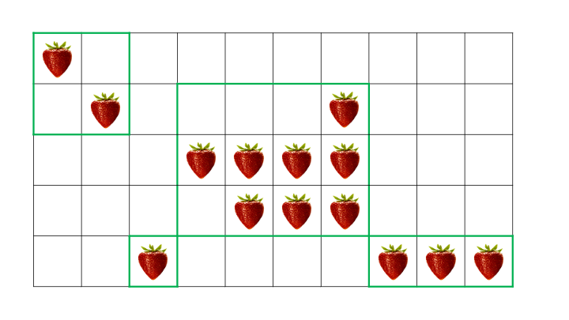

.. _colgen:

*************************************************************************************************
Column Generation
*************************************************************************************************

Theory
=======================================

* `Videos <https://youtube.com/playlist?list=PLq6RpCDkJMyobHEz18UKAi0KdNq0b7CGr>`_
* `Slides <https://www.icloud.com/keynote/0auCebdBmXo5DgigkyxgDESFg#05-column-generation>`_

Exercises
=======================================

Strawberry Problem
"""""""""""""""""""""""""""""""""""""""

Strawberries are growing in the cells of a rectangular field of dimensions :math:`A` times :math:`B`.
You want to build greenhouses to enclose the strawberries.
Greenhouses are rectangular, axis-aligned with the field (i.e., not diagonal), and may not overlap.
The cost of each greenhouse is :math:`C_g` plus :math:`C_u` per unit of area covered.
The function :math:`s(i,j)` (with :math:`1\leq i\leq A, j\leq y\leq B`) is equal to :math:`1` if there is a strawberry  plant on square :math:`(i,j)`.

How to cover all the strawberries at minimal cost ?

#. Imagine a column generation approach and derive the restricted master problem.
#. Derive the pricing problem and give an algorithm to solve it.

   A 5x10 field with strawberries and a possible set of greenhouses.
