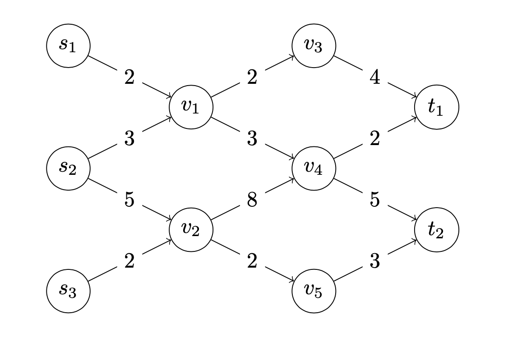
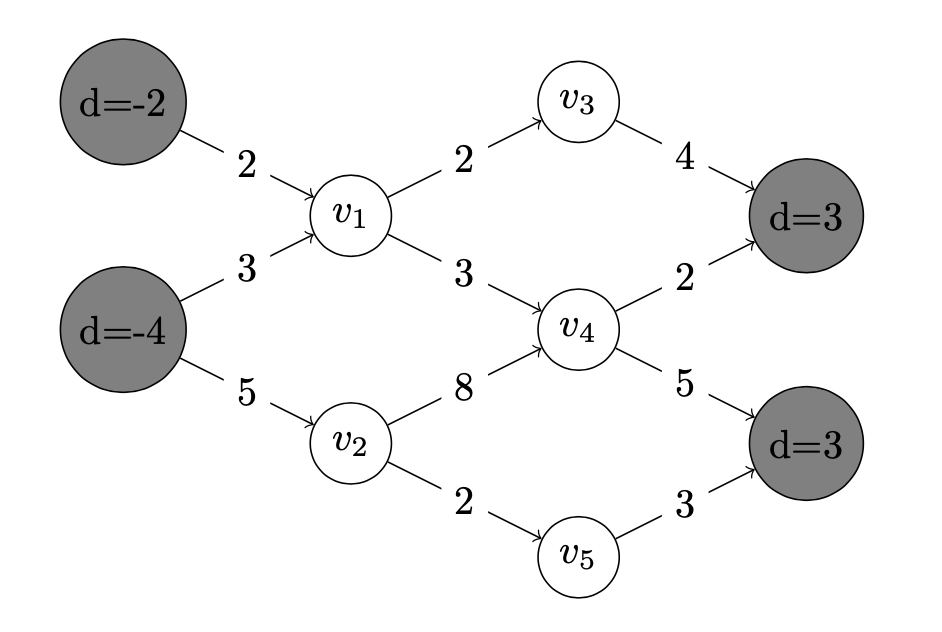
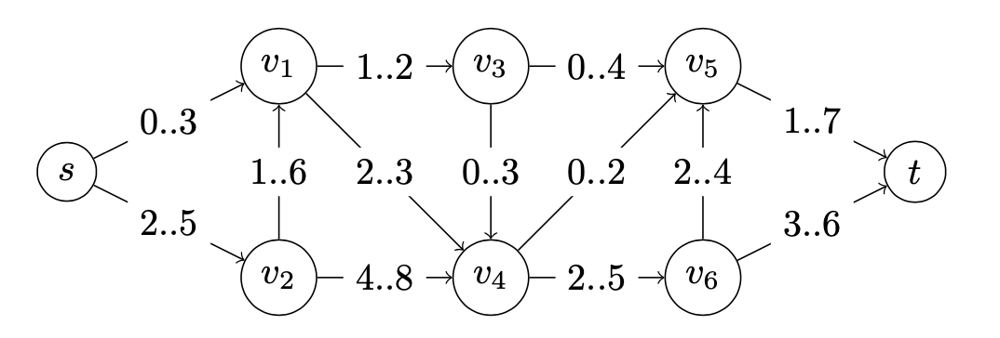

.. _flows:

*************************************************************************************************
Network Flows
*************************************************************************************************

Theory
=======================================

* `Videos <https://youtube.com/playlist?list=PLq6RpCDkJMyr5nx6tY1MVm-i7Pn9JcCM1>`_
* `Slides  <https://www.icloud.com/keynote/0t_dCJiKbYTXbaevE-bU96rmg#09-flows>`_

An elegant implementation of the max flow problem `Algorithms <https://algs4.cs.princeton.edu/64maxflow/>`_.

Exercises
=======================================

Maximum Flow: Ford-Fulkerson Algorithm
"""""""""""""""""""""""""""""""""""""""

Given the network below:

#. Formulate the Maximum Flow problem as a linear program.
#. Transform the network in order to have only one source and one sink but the same maximum flow.
#. Apply the Ford-Fulkerson algorithm, using augmenting paths and residual graphs.
#. Give the minimum cut associated to the final maximal flow you obtained.
#. Illustrate the execution of the Ford-Fulkerson algorithm with scaling.

   A network with multiple sources and sinks.

Maximum Flow: Variants
"""""""""""""""""""""""""""""""""""""""

1. Transform the maximum flow problem with exact node demands shown below in a maximum flow problem.

   A network with node demands.

2. Transform the maximum flow problem with minimum edge demands shown below in a maximum flow problem.

   A network with minimum edge demands.
