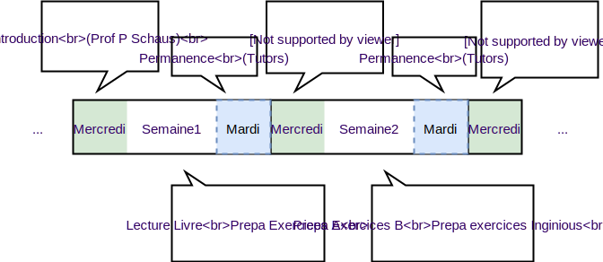

	.. _intro:

************
Organisation
************

Le livre de référence utilisé pour ce cours est
`Algorithms <https://algs4.cs.princeton.edu/home/>`_ (4e édition)
de Robert Sedgewick et Kevin Wayne.

Il est important de vous **procurer ce livre le plus rapidement possible**.

Pédagogie
=======================================

La pédagogie utilisée est celle des `classes inversées <https://fr.wikipedia.org/wiki/Classe_inversée>`_.

Par conséquent, les élèves doivent impérativement travailler chez eux:

* lire les chapitres mentionnés du livre de référence,
* programmer régulièrement en faisant les exercices proposés sur Inginious_

Le cours utilise le langage *Java* et plus spécifiquement la version Java8_.
L'IDE recommandé pour ce cours et disponible à l'examen est IntelliJ_.
Nous utiliserons également l'outil Junit4_ pour réaliser des tests unitaires.
Il est fortement recommandé de vous familiariser à ces outils en préparation à l'examen.

.. _Java8: https://docs.oracle.com/javase/8/docs/api.
.. _IntelliJ: https://www.jetbrains.com/idea/
.. _Inginious: https://inginious.info.ucl.ac.be
.. _JUnit4: https://junit.org/junit4/.

Cours Open-Source
=======================================

Les sources de ce site web sont open-source et sur `bitbucket <https://bitbucket.org/pschaus/lsinf1121/src/master/>`_.
Pull request welcome

La licence utilisée est Creative Commons Attribution-ShareAlike 4.0 International License:

.. image:: https://i.creativecommons.org/l/by-sa/4.0/88x31.png
    :alt: CC-BY-SA

Agenda
=======================================

Le cours est organisé en 6 modules de 2 semaines.

* mercredi semaine 1: introduction et motivation pour la matière (en auditoire avec Prof. P. Schaus)
* semaine 1: lecture des chapitres par les étudiants et préparation des exercices théoriques A
* mercredi semaine 2: correction des exercices théoriques A (en auditoire avec TA. G. Derval)
* semaine 2: préparation des exercices théoriques B et exercices sur Inginious
* mercredi semaine 3: restructuration et correction exercices théoriques B [+ début module suivant] (auditoire avec Prof. Pierre Schaus)

Le cours d'introduction, de TP et de restructuration se donne le mercredi à 14h (attention vérifiez bien l'auditoire, il y a des changements d'une semaine à l'autre).

Les TP seront donnés le jeudi sur `teams <https://teams.microsoft.com/l/team/19%3aqmiZIHdcRhij9hhpTWgAcGw4wC4MYuXpTunnWDxPqJ01%40thread.tacv2/conversations?groupId=8a1f27d1-ad11-4ba2-a7e3-45455bd71ef9&tenantId=7ab090d4-fa2e-4ecf-bc7c-4127b4d582ec>`_.
Chaque étudiant reçoit un tuteur à qui il peut poser ses questions pendant les deux heures du TP par écrit ou via un appel teams.
Bien sûr, rien ne vous empêche de poser des questions via le chat avec votre tuteur en dehors du slot prévu.
Il vous répondra dès qu'il peut.

* S1-S3 :doc:`partie1 <../part1/index>`
* S3-S5 :doc:`partie2 <../part2/index>`
* S5-S7 :doc:`partie3 <../part3/index>`
* S8-S10 :doc:`partie4 <../part4/index>` attention, mid-term-quizz à la place du cours à 14h00 (à domicile ou salle info sur inginious)
* S10-S12 :doc:`partie5 <../part5/index>`
* S12-S14 :doc:`partie6 <../part6/index>`

Evaluation
=======================================

Examen sur Inginious + Une évaluation mid-term lors de la S8 sur Inginious (matière portant sur parties 1 à 3).

L'évaluation mid-term compte pour 2 points sur 20 à l'examen uniquement si elle fait remonter la moyenne de l'étudiant.
La même pondération est appliquée au mois d'août.
Il est donc fortement conseillé de vous préparer et de participer à l'évaluation mid-term.

Exemple1: évaluation mid-term: 15/20, examen 10/20, total: maximum(10,15*0.1+10*0.9)=10.5.

Exemple2: évaluation mid-term 6: 8/20, examen 12/20, total: maximum(12,8*0.1+12*0.9)=12.

Contact et communication
=======================================

Les communications importantes avec les étudiants se feront via moodle.
Nous vous recommandons cependant de vérifier régulièrement cette page également.
Pour toutes communications importantes, vous pouvez également nous écrire par mail.

`Pierre Schaus <pierre.schaus@uclouvain.be>`_ et
`Guillaume Derval <guillaume.derval@uclouvain.be>`_.
