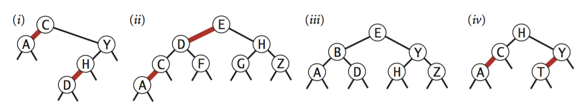

.. _part3:

************************************************************************************************
Partie 3 | Arbres de recherche
************************************************************************************************

Objectifs
=========

A l'issue de cette partie chaque étudiant sera capable de:

* de décrire avec exactitude et précision les concepts d'arbres binaires de recherche et de table de symboles ordonnée;
* de mettre en oeuvre des algorithmes basés sur les arbres de recherche;
* d'évaluer et mettre en oeuvre des représentations classiques d'arbres de recherche;

A lire
=======================================

Livre de référence:

* Chapitres 3.1, 3.2 et 3.3

Slides (keynote)

* `Introduction <https://www.icloud.com/keynote/0XRcJhjLaXKDgGXmYP_obsvtQ#part3-intro>`_ 
* `Séance Intermédiaire <https://www.icloud.com/keynote/0ci2fEeuSuJLs64Uy5lYXBi_g#part3-exercises>`_  (attention celle-ci sera faite en même temps que la restructuration en S7)
* `Restructuration <https://www.icloud.com/keynote/06MTKLmzIm6CiPon3fChb2vbA#part3-bilane>`_ 

.. raw:: html

  <iframe width="560" height="315" src="https://www.youtube.com/embed/PJWVL15ntl8" frameborder="0" allow="accelerometer; autoplay; encrypted-media; gyroscope; picture-in-picture" allowfullscreen></iframe>

Exercices théoriques: première partie
=======================================

.. note::
   Vous devez faire ces exercices pour le mercredi de S6.

Exercice 3.1.1
""""""""""""""

Laquelle des deux implémentations `SequentialSearchST` ou `BinarySearchST` utiliseriez vous pour une application
qui réalise :math:`10^3` `put()` et :math:`10^6` `get()` dans un ordre aléatoire? Justifiez.

Exercice 3.1.2
""""""""""""""

Implémentez la méthode `floor()` de `BinarySearchST`.

Exercice 3.1.3
"""""""""""""""

*Exercice 3.1.24 du livre*.

En supposant que les clefs soient des doubles ou des entiers. Écrivez une version de la recherche binaire qui supposant
une répartition uniforme des clefs va d'abord chercher au début d'un dictionnaire un mot qui commence par une lettre
proche du début d'alphabet.

Plus exactement, si la clef recherchée est :math:`k_x`, et que la plus petite clef est :math:`k_{lo}` et la plus grande
est :math:`k_{hi}`, cherchez d'abord au pourcentile :math:`\lfloor(k_x-k_{lo})/(k_{hi}-k_{lo}) \rfloor * 100` du tableau
et pas au milieu (pourcentile 50) du tableau d'abord.

Implémentez `InterpolationSearchST` et comparez celle-ci sur `FrequencyCounter`.

Exercice 3.1.4
"""""""""""""""

*Exercice 3.1.25 du livre*.

Il est très fréquent de tester d'abord la présence d'une clef avant d'ajouter ou modifier l'entrée correspondante. Cela
engendre successivement plusieurs recherches consécutives de la même clef.

L'idée du *caching* est de mémoriser en interne la dernière clef accédée
et de l'utiliser de manière opportuniste si celle-ci est toujours valide.
Modifiez `BinarySearchST` pour y intégrer cette idée.

Exercice 3.1.5
""""""""""""""

*Exercice 3.2.31 du livre*.

Écrivez une méthode `isBST()` qui prend un `Node` comme argument et qui retourne `true` si l'argument est la racine
d'un BST, `false` sinon (il faut donc vérifier que les propriétés d'un BST sont satisfaites).

Est-ce que vérifier (localement) si pour chaque noeud la propriété *"le fils gauche a une clef inférieure et le fils
droit une clef supérieure"* est suffisant? Si non donnez un contre-exemple.

Quelle est la complexité de votre algorithme ?

Exercice 3.1.6
""""""""""""""

*Exercice 3.2.4 du livre*.

Supposons qu'un certain arbre de recherche possède des clefs entre 1 et 10 et que nous cherchions la clef 5.
Quelle(s) séquence(s) ne peut pas correspondre à la séquence des clefs examinées?

* 10,9,8,7,6,5
* 4,10,8,6,5
* 1,10,2,9,3,8,4,7,6,5
* 2,7,3,8,4,5
* 1,2,10,4,8,5

Exercice 3.1.7
""""""""""""""

*Exercice 3.3.33 du livre*.

Écrivez une méthode `is23()` dans `RedBlackBST` qui vérifie qu'aucun noeud n'est connecté
à deux liens rouges et qu'il n'y a pas de lien rouge vers la droite.
Écrivez aussi une méthode `isBalanced()` qui vérifie que tout chemin depuis la racine vers vers un lien null a le
même nombre de liens noirs. Finalement combinez `isBST(),is23()` et `isBalanced()` pour implémenter `isRedBlackBST()`.

Exercice 3.1.8
""""""""""""""

Comment faire pour énumérer en ordre croissant toutes les clés mémorisées
dans un arbre binaire de recherche ? Quelle est la complexité temporelle de
cette opération ? Justifiez votre réponse.

Exercice 3.1.9
""""""""""""""

Partant d'un arbre binaire de recherche initialement vide, comment se présente l'arbre
après y avoir inséré les clés 12, 5, 10, 3, 13, 14, 15, 17, 18, 15 ? Pour les mêmes données comment se présenterait
l'arbre finalement obtenu s'il s'agissait d'un 2-3 arbre ?

Cet exemple illustre-t-il les avantages ou inconvénients de ces différentes structures de données ? Pourquoi ?

Exercice 3.1.10
"""""""""""""""

Lequel ou lesquels de ces arbres est(sont) red-black? Pour chacun, dessiner la correspondance vers un 2-3 tree
(décrite p432).

Exercices sur Inginious
==========================================

.. note::
   Vous devez faire ces exercices pour le mercredi de S7.

1. `Unit tests redblack <https://inginious.info.ucl.ac.be/course/LSINF1121-2016/PART3WriteUnittestsRedBlackTree>`_
2. `QCM Complexite <https://inginious.info.ucl.ac.be/course/LSINF1121-2016/PART3Qcm>`_
3. `QCM Traversal <https://inginious.info.ucl.ac.be/course/LSINF1121-2016/PART3QcmBt>`_
4. `Exercice redblack <https://inginious.info.ucl.ac.be/course/LSINF1121-2016/PART3Rbt>`_
5. `Implémentation de ceil <https://inginious.info.ucl.ac.be/course/LSINF1121-2016/PART3Bst>`_
6. `Implémentation d un iterateur sur un BST <https://inginious.info.ucl.ac.be/admin/LSINF1121-2016/edit/task/PART3OrderedBstIterator>`_ 

Exercices théoriques: deuxième partie
=======================================

.. note::
   Vous devez faire ces exercices pour le mercredi de S7.

Exercice 3.2.1
"""""""""""""""

Vrai ou faux ? 

Remarque: BST s'entend ici comme l'implémentation du livre, c'est-à-dire un arbre qui n'est pas nécessairement équilibré.
Les 2-3/red-black BST s'entendent également comme étant celles du livre de référence. 

Nous recommandons de vous familiariser préalablement avec les notions de `parcours d'arbres <https://fr.wikipedia.org/wiki/Arbre_binaire#Parcours_préfixe>`_: infixe, préfixe et postfixe.

* Dans le meilleur des cas, le nombre de comparaisons entre clefs pour une recherche binaire d'une clef particulière dans un tableau trié de N clefs distinctes est :math:`\sim \log N`.
* Étant donné un parcours infixe d'un BST contenant N clefs distinctes. Est-il possible de reconstruire la forme du BST sur base du résultat du parcours ? Si oui, écrivez le pseudo-code d'un algorithme pour le faire, si non, donnez un contre-exemple qui justifie votre réponse.
* Étant donné un parcours préfixe d'un BST contenant :math:`N` clefs distinctes. Est-il possible de reconstruire la forme du BST sur base du résultat du parcours ? Si oui, écrivez le pseudo-code d'un algorithme pour le faire, si non, donnez un contre-exemple qui justifie votre réponse.
* Étant donné un arbre ordonné de :math:`N` clefs distinctes et une clef :math:`x`, est-il possible de trouver la plus petite clef strictement plus grande que :math:`x` en temps logarithmique dans le pire cas?
* La hauteur attendue d'un BST résultant de l'insertion de N clefs distinctes dans un ordre aléatoire dans un arbre initialement vide est en moyenne logarithmique. 
* Soit :math:`x` un noeud dans un BST. Le successeur de :math:`x` (le noeud contenant la clef suivante dans l'ordre croissant) est le noeud le plus à gauche dans l'arbre de droite de :math:`x`.
* La hauteur maximum d'un 2-3 tree avec N clefs est :math:`\sim \log_3 N`
* Pour l'insertion de N clefs dans l'ordre croissant dans un red-black BST initialement vide. Le nombre de changements de couleur de la dernière insertion est au plus 3.
	  Le nombre de changements s'entend comme la somme des différences en valeur absolue entre le nombre de rouges après insertion moins le nombre de rouges avant insertion.
* Un red-black BST obtenu après insertion de :math:`N > 1` clefs dans un arbre initialement vide possède au moins un lien rouge ? Si non, donnez un contre-exemple.
* Dans un red-black BST de N noeuds, la hauteur noire (i.e. le nombre de liens noirs de chaque chemin depuis la racine vers un lien null) est maximum :math:`\log N`.

Exercice 3.2.2
""""""""""""""""

Imaginez un algorithme de tri utilisant un BST. A quoi ressemblerait cet algorithme ?
Quelle serait la complexité de votre algorithme si le BST est remplacé par un red-black BST ?

Exercice 3.2.3
""""""""""""""""

Est-ce que l'opération de suppression dans un BST est "commutative" ?
C'est à dire que supprimer :math:`x` et ensuite directement :math:`y` d'un BST (tel qu'implémenté dans le livre) 
laisse l'arbre dans même état que si on avait d'abord supprimé :math:`y`  et puis :math:`x` ?
Donner un contre-exemple ou argumenter pourquoi c'est effectivement toujours le cas. 
Pour vous aider, considérez l'arbre suivant et les opérations de suppression de 5 et 10.

.. code-block:: java

      10
     / \
    5   15
       /
      11
 

